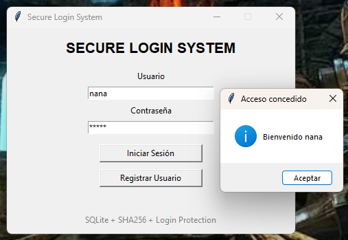
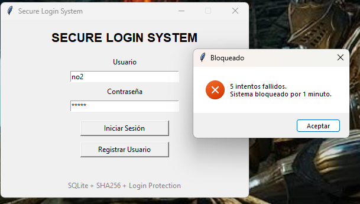

# Secure Login System

A secure login application built with Python, Tkinter, SQLite and SHA-256 password hashing.

## Features

- User registration
- Secure password hashing
- SQLite database
- Failed login protection
- 1-minute lockout after 5 failed attempts
- Activity logging

## Screenshots

## Screenshots

### Main Window


### Successful Login



### Account Lockout


## Technologies

- Python
- Tkinter
- SQLite3
- Hashlib
- Datetime

## Run

```bash
python main.py
```
